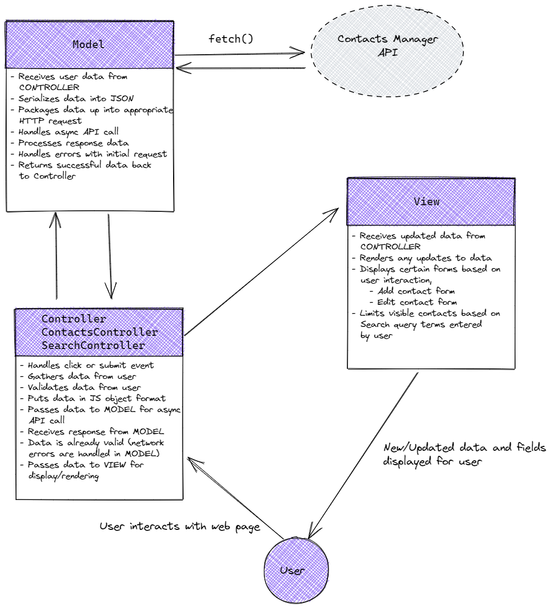
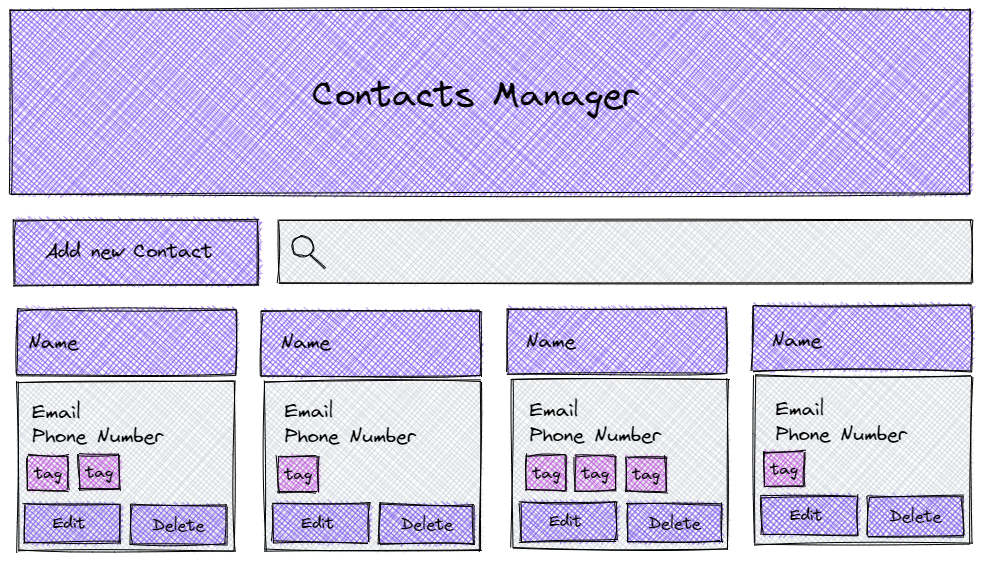

# JS239 Contact Manager App

Practice project for the JS239 take-home project assessment

## Contents

- [Notes on Demo and required functionality](#demo-and-required-functionality)
- [Basic Design Outline](#design-overview)

## Demo and Required Functionality

- Home page displays an add contact button, search bar, and list of contacts
  - If there are no contacts, a message saying "There are no contacts" is displayed with additional add contact button
- Each contact has a name, phone number, e-mail, and list of "tags" (i.e. "sales", "marketing", etc)
- Clicking on a tag shows only the contacts pertaining to that tag
- When displayed, each contact shows an edit button and delete button

### Adding a Contact

- We add a contact by clicking the "Add Contact" button
- This displays a form (`/#home` -> `/#contacts/new`, or do we want it to be single-page web app?)
- The form has the following fields
  - Full name
  - Email address
  - Telephone number
  - Drop down list of available tags to add to the contact
- The drop down list should have functionality to add a new tag if necessary (is this a different form that pops up?)
- We have button options to either submit the form, or cancel
- Submitting adds the new contact information to the API. Text fields should be automatically formatted appropriately (i.e. dashes inserted into phone numbers, lower case e-mails, capitalized names)
- Canceling brings us back to the home page

### Editing a Contact

- We edit a contact by clicking the "Edit Contact" button for an individual contact
- This displays a form (`/#home` -> `/#contacts/edit/{CONTACT_ID}`)
- The form has the following fields
  - Full name
  - Email address
  - Telephone number
- The original data is populated as the placeholder text for the input fields
- Same functionality for the drop down list as in "Adding a Contact" above?
- We have button options to either submit the form, or cancel
- Submitting adds the new contact information to the API. Text fields should be automatically formatted appropriately (i.e. dashes inserted into phone numbers, lower case e-mails, capitalized names)
- Canceling brings us back to the home page

### Deleting a Contact

- Contacts are deleted by clicking the "Delete Contact" button for an individual contact
- This displays a confirmation popup asking "Do you want to delete this contact?" and the user must click OK to proceed
- Once we click ok, the contact in question is deleted

### Search Bar

- Tying a value into the search bar limits the contacts displayed to those that match the given value
- If there are no matching values, a message is displayed saying "There are no contacts starting with {VALUE}".
- The value can be matched with either the first or last name of a contact

## Design Overview

- **Controller Interface**:
  - Uses `Model` to for CRUD actions upon contact/tag data
  - Receives data from `Model`, pass it to `View` for rendering
  - May be subdivided into specific types of controllers, i.e. `ContactController`, `TagController`, etc)
  - Data validation happens here?
- **Model Interface**:
  - Handles interactions with the API (i.e asynchronous AJAX calls, HTTP request/responses)
  - Passes data to `Controller` so it can interface with `View`
- **View Interface**:
  - Renders data for the user, i.e. `display*` methods
  - Receives data from `Controller`for rendering

## To Do

### Known Bugs

- The Add a Tag event handler doesn't work in Chrome! 
  - Fix idea: delegate the event by registering on select and checking to see if target id matches option element?
- If we add a new tag, and then do not assign that tag to any contacts, it remains in the list of available tags to choose from. This is annoying, especially if the user makes a typo.
  - Fix idea 1: query the database for an updated list of all tags each time the form is rendered. This should be fairly simple to implement, but adds lag time to form display.
  - Fix idea 2: give user an option to remove tags from the select list. Cons: difficult to implement.
- There is a bit of a delay when user clicks edit button before edit form appears (because we are loading values in from the database.
- *Not Tested*: if we have more than one row of tags for a contact card, the styling breaks.

### General Refactoring

- The `View` is getting unwieldy. Consider separating it out into segments (i.e. `ContactFormView`, `SearchView`, etc). Also: review naming conventions here
- Review the following:
  - `Controller.submitContactHandler`
  - `View.bindAddNewTagHandler`
- Refactor `controller.js` to take advantage of `async/await` keywords
- In `Controller.deleteContactHandler` we clear and reload the entire contacts list when a contact is deleted. Maybe we implement a new method in `View` that can find and remove the single contact card in question instead?

### Features to Implement

- Search bar

### Done

- Clicking on a tag should filter the visible contact cards to include only those that contain the tag that was clicked
  - Add a method in `View` that binds an event handler to contacts list that deals with `click` events on tag elements
  - Add a method in `Controller` that handles the event:
    - Gets the contacts that have matching tags (`Model.getContactsMatchingTag(tag)`)
    - Clear out the current contacts list (`View.clearContactsList()`)
    - Passes the contacts to `View.displayContactsList(contacts)`
  - When contacts are filtered by tag, we need a way to go back to all contacts
    - Display a "Return to All Contacts" Button
    - Add a message saying "Displaying all {{tag}} contacts"?
    - Clicking the "Return to All Contacts" Button goes back to full view of all contacts
- ~~The user can add a tag `+ Add a new tag`~~ Fixed
- ~~When the user either adds or edits a contact with no tags, the tag value in the DB is set to `''` rather than `null`.~~ Fixed
- ~~When user edits a contact and opens up edit form (by clicking on edit icon):~~ Fixed
  - ~~If the contact in question has a single tag, it is pre-selected, and there is no way to de-select~~
  - ~~If the contact in question has multiple tags, no tags are pre-selected~~
  - Note: there are some interesting issues with the select field in general, but these seem to be endemic to the element used. Might be better in the future to go with a different approach (i.e. checkboxes or custom dropdown).

